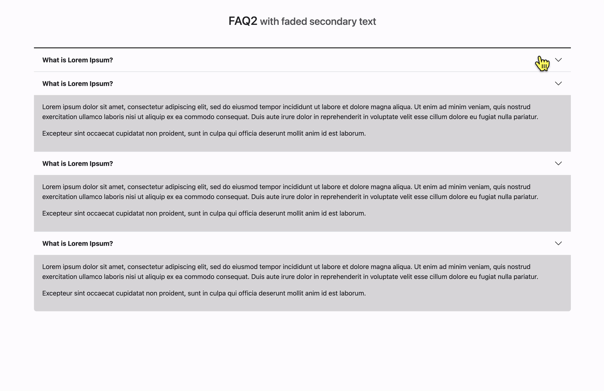

# 아코디언 만들기


### 1.table 요소를 이용해 표를 만든다.

```html
<table>
	<caption></caption>
	<thead>
		<tr>
			<td></td>
		</tr>
	</thead>
	<tbody>
		<tr>
			<td></<td>>
		</tr>
	</tbody>
</table>
```

### 2. CSS 애니메이션과 높이값을 이용해 아코디언 형식을 만든다.

- 높이를 정해줘야지만 transition이 적용된다. <br/>
  display : none -> block은 transition이 작동안함

```
  display: block;
  height: 300px;
```

- 변화가 시작되는 쪽에다가 transition 적용해준다 0 -> 300px
  왜? 닫기 버튼을 누를 때 변화가 티남

```
transition: all 1.35s;
```

### 3. javascript를 이용해 class를 동적으로 적용해준다.

`addEventListener click`을 이용해서 FAQ 제목을 클릭시 본문이 보이게 `active` 클래스를 추가해주는 코드를 작성한다.

```javascript
panelFaqAnswer[i].classList.toggle('active');
```

<hr />

# 아코디언 만들기2



`<details>` 태그와 `<summary>` 태그를 이용한 아코디언 만들기

accordion2.html 파일 참고하기

참고 >

- https://codingeverybody.kr/css-details-%ed%83%9c%ea%b7%b8-%ec%8a%a4%ed%83%80%ec%9d%bc-%ea%be%b8%eb%af%b8%ea%b8%b0/#marker-style
- https://blogpack.tistory.com/1026
